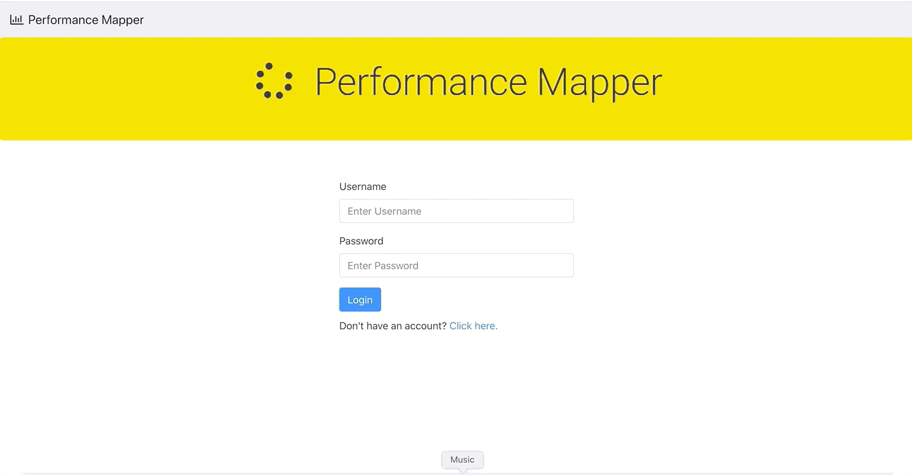

### Flatiron School: Seattle 0420 Cohort
# Performance Mapper: Final Project

### Description: 
This is the backend repo for Performance Mapper and is necessary to run the application locally. This project was designed to enable strength and conditioning coaches to to record, monitor, and track their teams'/athletes' performance statistics and injuries, as well as visualize key trends in data across their teams and athletes. Key features are as follows:

* User Login and Homepage with horizontal bar chart of cumulative injuries across teams.



* User can view and add/delete their teams. Broken images get fixed with an automatic default image.


* View average stats and trends of performance measures, sorted by date and separated by test in individual tabs.


* View injuries across the team, data presented by site of each injury. Can click for a more detailed view of injuries (dates, descriptions, severities, etc.).


* View athletes across the team, and add/delete athletes.Broken images get fixed with an automatic default image.


* View performance statistics and trends for a specific athlete, sorted by date. Tabs for tests are dynamically added as the user adds new tests.


* View injuries for a specific athlete. Data presented by site of each injury. Can click for a more detailed view of injuries (dates, descriptions, severities, etc.). 


* Add and delete performance statistics. Graph will dynamically update as stats are added/deleted. Each stat/test is automatically added or removed from the team averages.


* Add and delete injuries. Graph will dynamically update as injuries are added/deleted. Each injury is automatically added or removed from the team and home charts.


The backend of the application leverages Ruby on Rails API functionality to receive and send AJAX requests in a JSON formate. The interactive frontend is build on ReactJS, HTML, and CSS.

### Dependencies:
* Developed on Google Chrome (80.0.3987.149)
* Ruby (2.6.1)
* RAILS (6.0.2.2)
* Bundler (2.1.4)
* PostgreSQL (12.3)

### Front End Dependencies
Refer to the frontend repo at https://github.com/ckaiser258/Final_Project_Frontend for instructions to set up the front-end interface and ReactJS.

### Installation:

Download this entire git repository to your computer and place in your desired install directory. If you don't have the above dependencies, in your terminal run `ruby -e "$(curl -fsSL https://raw.githubusercontent.com/Homebrew/install/master/install)"` to install Homebrew, then run `brew install rbenv ruby-build` to install Ruby, then `rbenv install 2.7.1` `rbenv global 2.7.1` and `ruby -v` to confirm. Finally, to install Rails, run `gem install rails -v 6.0.2.2` `rbenv rehash` and `rails -v` to confirm. If you need to install PostgreSQL, follow their instructions here: https://postgresapp.com/.

Via a terminal interface navigate to where you installed this repository. From this location execute ```bundle install``` to install all other required gem packages. 

### Running:
This project was designed as a proof of concept so it requires hosting locally. To start hosting the local server, start by opening PostgreSQL and starting the server. Then, in your terminal navigate to the directory you've installed this repo in. Once there, execute `rails db:create`, `rails db:migrate`,`rails db:seed`, and finally ```rails s```. The rails server is functioning solely as a backend API for local development, so you do not need to navigate to localhost:3000 in your browser unless you'd like to test to make sure the database is running correctly. It's recommended to run the backend on port 3000 then the front end on a different port (React will prompt you to do this).

### License
Copyright 2020 Colton Kaiser

Permission is hereby granted, free of charge, to any person obtaining a copy of this software and associated documentation files (the "Software"), to deal in the Software without restriction, including without limitation the rights to use, copy, modify, merge, publish, distribute, sublicense, and/or sell copies of the Software, and to permit persons to whom the Software is furnished to do so, subject to the following conditions:

The above copyright notice and this permission notice shall be included in all copies or substantial portions of the Software.

THE SOFTWARE IS PROVIDED "AS IS", WITHOUT WARRANTY OF ANY KIND, EXPRESS OR IMPLIED, INCLUDING BUT NOT LIMITED TO THE WARRANTIES OF MERCHANTABILITY, FITNESS FOR A PARTICULAR PURPOSE AND NONINFRINGEMENT. IN NO EVENT SHALL THE AUTHORS OR COPYRIGHT HOLDERS BE LIABLE FOR ANY CLAIM, DAMAGES OR OTHER LIABILITY, WHETHER IN AN ACTION OF CONTRACT, TORT OR OTHERWISE, ARISING FROM, OUT OF OR IN CONNECTION WITH THE SOFTWARE OR THE USE OR OTHER DEALINGS IN THE SOFTWARE.
